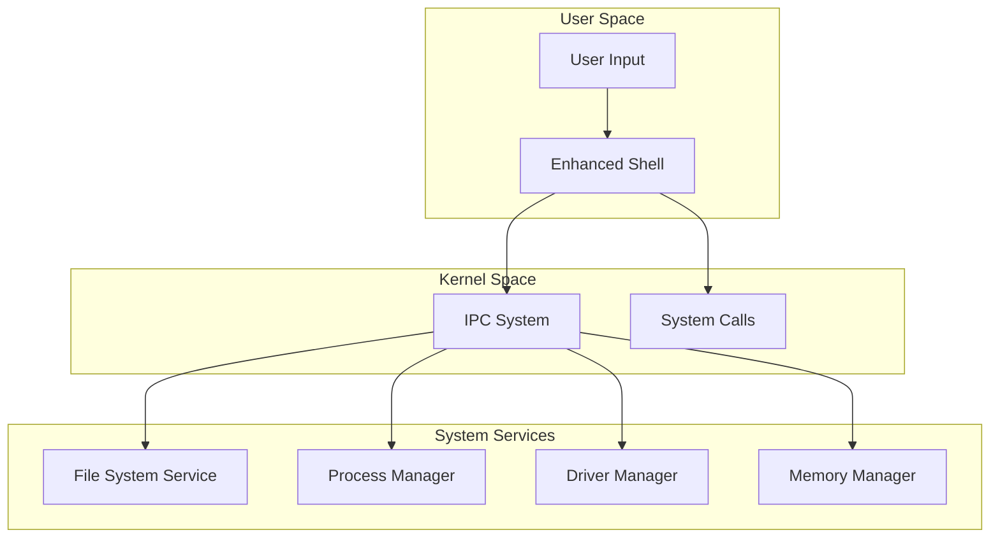
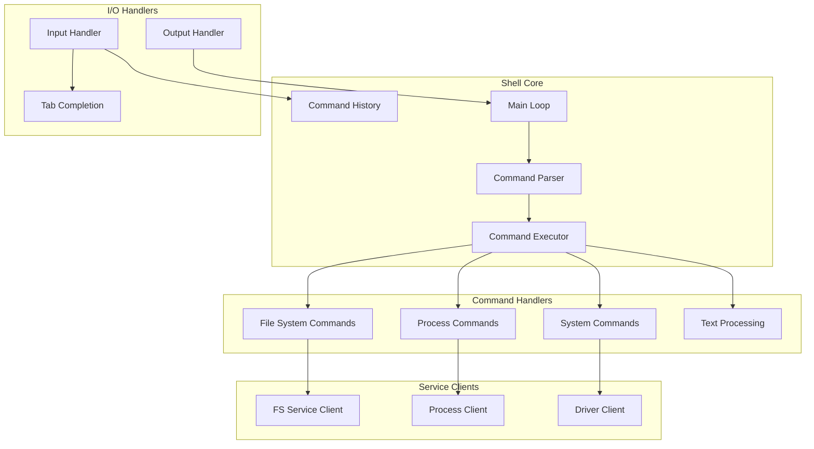

# Enhanced Kosh Shell Design Document

## Overview

The enhanced Kosh shell will transform the existing basic shell implementation into a fully functional Unix-like command line interface. The design leverages Kosh's microkernel architecture, communicating with system services through IPC messages to provide real file system operations, process management, and system utilities.

The shell operates as a user space application that acts as an intermediary between users and the Kosh system services, translating Unix commands into appropriate service requests and presenting results in a familiar command-line format.

## Architecture

### High-Level Architecture



### Shell Component Architecture



## Components and Interfaces

### Command Parser

The command parser handles parsing user input into executable commands with support for advanced shell features:

```rust
pub struct CommandParser {
    pub history: CommandHistory,
    pub variables: HashMap<String, String>,
}

pub struct ParsedCommand {
    pub command: String,
    pub args: Vec<String>,
    pub input_redirect: Option<String>,
    pub output_redirect: Option<String>,
    pub pipe_to: Option<Box<ParsedCommand>>,
    pub background: bool,
    pub conditional: Option<ConditionalType>,
}

pub enum ConditionalType {
    And,    // &&
    Or,     // ||
}
```

### Service Communication Layer

The shell communicates with system services using Kosh's IPC system:

```rust
pub struct ServiceClient {
    fs_service_pid: Option<ProcessId>,
    process_service_pid: Option<ProcessId>,
    driver_service_pid: Option<ProcessId>,
}

impl ServiceClient {
    pub async fn send_fs_request(&self, request: FileSystemRequest) -> Result<ServiceResponse, ServiceError>;
    pub async fn send_process_request(&self, request: ProcessRequest) -> Result<ServiceResponse, ServiceError>;
    pub async fn send_driver_request(&self, request: DriverRequest) -> Result<ServiceResponse, ServiceError>;
}
```

### Command Execution Engine

The execution engine handles different types of commands and manages their lifecycle:

```rust
pub struct CommandExecutor {
    service_client: ServiceClient,
    current_directory: PathBuf,
    environment: HashMap<String, String>,
    background_jobs: Vec<BackgroundJob>,
}

pub struct BackgroundJob {
    pub job_id: u32,
    pub pid: ProcessId,
    pub command: String,
    pub status: JobStatus,
}

pub enum JobStatus {
    Running,
    Stopped,
    Completed(i32),
}
```

### File System Command Handlers

File system commands interact with the FS service through IPC:

```rust
pub struct FileSystemCommands {
    service_client: Arc<ServiceClient>,
    current_dir: PathBuf,
}

impl FileSystemCommands {
    pub async fn ls(&self, path: Option<&str>, flags: LsFlags) -> Result<String, CommandError>;
    pub async fn cd(&mut self, path: &str) -> Result<(), CommandError>;
    pub async fn mkdir(&self, path: &str, recursive: bool) -> Result<(), CommandError>;
    pub async fn rm(&self, path: &str, recursive: bool, force: bool) -> Result<(), CommandError>;
    pub async fn cat(&self, path: &str) -> Result<String, CommandError>;
    pub async fn touch(&self, path: &str) -> Result<(), CommandError>;
}
```

### Process Management Commands

Process commands use system calls and process service communication:

```rust
pub struct ProcessCommands {
    service_client: Arc<ServiceClient>,
}

impl ProcessCommands {
    pub async fn ps(&self, show_all: bool) -> Result<Vec<ProcessInfo>, CommandError>;
    pub async fn kill(&self, pid: ProcessId, signal: Signal) -> Result<(), CommandError>;
    pub async fn killall(&self, name: &str) -> Result<u32, CommandError>;
    pub async fn jobs(&self) -> Result<Vec<BackgroundJob>, CommandError>;
}

pub struct ProcessInfo {
    pub pid: ProcessId,
    pub ppid: ProcessId,
    pub name: String,
    pub state: ProcessState,
    pub cpu_time: Duration,
    pub memory_usage: usize,
}
```

### Input/Output Handling

Enhanced I/O handling with support for advanced terminal features:

```rust
pub struct InputHandler {
    history: CommandHistory,
    completion_engine: TabCompletion,
    input_buffer: Vec<char>,
    cursor_position: usize,
}

impl InputHandler {
    pub async fn read_line(&mut self) -> Result<String, InputError>;
    pub fn handle_special_key(&mut self, key: SpecialKey) -> KeyAction;
    pub fn get_completions(&self, partial: &str) -> Vec<String>;
}

pub struct OutputHandler {
    pager: Option<Pager>,
    color_support: bool,
}

impl OutputHandler {
    pub fn print_with_paging(&self, content: &str) -> Result<(), OutputError>;
    pub fn print_colored(&self, text: &str, color: Color) -> Result<(), OutputError>;
    pub fn format_table(&self, data: &[Vec<String>]) -> String;
}
```

## Data Models

### Command History

```rust
pub struct CommandHistory {
    commands: VecDeque<HistoryEntry>,
    max_size: usize,
    current_index: Option<usize>,
}

pub struct HistoryEntry {
    command: String,
    timestamp: SystemTime,
    exit_code: Option<i32>,
    working_directory: PathBuf,
}
```

### Tab Completion

```rust
pub struct TabCompletion {
    command_cache: HashMap<String, Vec<String>>,
    file_cache: HashMap<PathBuf, Vec<String>>,
}

impl TabCompletion {
    pub fn complete_command(&self, partial: &str) -> Vec<String>;
    pub fn complete_file_path(&self, partial: &str, current_dir: &Path) -> Vec<String>;
    pub fn complete_variable(&self, partial: &str, env: &HashMap<String, String>) -> Vec<String>;
}
```

### Environment Management

```rust
pub struct Environment {
    variables: HashMap<String, String>,
    path: Vec<PathBuf>,
    working_directory: PathBuf,
}

impl Environment {
    pub fn get_var(&self, name: &str) -> Option<&str>;
    pub fn set_var(&mut self, name: String, value: String);
    pub fn expand_variables(&self, input: &str) -> String;
    pub fn resolve_command(&self, command: &str) -> Option<PathBuf>;
}
```

## Error Handling

### Command Error Types

```rust
#[derive(Debug)]
pub enum CommandError {
    FileNotFound(String),
    PermissionDenied(String),
    InvalidArguments(String),
    ServiceUnavailable(ServiceType),
    ProcessNotFound(ProcessId),
    SystemCallFailed(u64, i32),
    ParseError(String),
    IoError(String),
}

impl CommandError {
    pub fn user_message(&self) -> String;
    pub fn suggest_fix(&self) -> Option<String>;
}
```

### Error Recovery

The shell implements graceful error handling:

1. **Service Failures**: Retry with exponential backoff, fallback to cached data
2. **Parse Errors**: Provide suggestions for similar commands
3. **Permission Errors**: Suggest alternative approaches or required permissions
4. **Resource Exhaustion**: Implement resource cleanup and user notification

## Testing Strategy

### Unit Testing

```rust
#[cfg(test)]
mod tests {
    use super::*;
    
    #[test]
    fn test_command_parsing() {
        let parser = CommandParser::new();
        let cmd = parser.parse("ls -la /home | grep user").unwrap();
        assert_eq!(cmd.command, "ls");
        assert_eq!(cmd.args, vec!["-la", "/home"]);
        assert!(cmd.pipe_to.is_some());
    }
    
    #[test]
    fn test_file_operations() {
        // Mock file system service for testing
        let mock_fs = MockFileSystemService::new();
        let fs_commands = FileSystemCommands::new(mock_fs);
        
        // Test directory listing
        let result = fs_commands.ls(Some("/"), LsFlags::default()).await;
        assert!(result.is_ok());
    }
}
```

### Integration Testing

```rust
#[cfg(test)]
mod integration_tests {
    #[test]
    fn test_full_shell_session() {
        let shell = EnhancedShell::new();
        
        // Test command sequence
        shell.execute_command("mkdir /tmp/test").await.unwrap();
        shell.execute_command("cd /tmp/test").await.unwrap();
        shell.execute_command("touch file.txt").await.unwrap();
        shell.execute_command("ls").await.unwrap();
        
        // Verify state
        assert_eq!(shell.current_directory(), Path::new("/tmp/test"));
    }
}
```

### Performance Testing

- Command execution latency benchmarks
- Memory usage profiling during long sessions
- Stress testing with large file operations
- Concurrent command execution testing

## Implementation Phases

### Phase 1: Core Infrastructure
- Enhanced command parser with pipe/redirect support
- Service client communication layer
- Basic error handling framework
- Command history implementation

### Phase 2: File System Commands
- Real ls, cd, pwd implementations
- File manipulation commands (mkdir, rm, touch, cat)
- Directory navigation with tab completion
- File permission handling

### Phase 3: Process Management
- Process listing and monitoring
- Signal handling and process control
- Background job management
- System information commands

### Phase 4: Advanced Features
- Command piping and redirection
- Environment variable management
- Advanced tab completion
- Command aliases and functions

### Phase 5: User Experience
- Colored output and formatting
- Paging for large outputs
- Command suggestions and help
- Performance optimizations

## Security Considerations

### Capability-Based Access Control

The shell operates within Kosh's capability system:

```rust
pub struct ShellCapabilities {
    file_system_access: CapabilitySet,
    process_management: CapabilitySet,
    system_information: CapabilitySet,
}
```

### Input Validation

All user input is validated and sanitized:

- Path traversal prevention
- Command injection protection
- Buffer overflow prevention
- Privilege escalation checks

### Service Communication Security

- Message authentication for service requests
- Capability verification before operations
- Secure handling of sensitive data
- Audit logging for security events

## Performance Optimizations

### Caching Strategy

```rust
pub struct ShellCache {
    command_cache: LruCache<String, CommandResult>,
    file_listing_cache: LruCache<PathBuf, Vec<FileInfo>>,
    completion_cache: LruCache<String, Vec<String>>,
}
```

### Asynchronous Operations

- Non-blocking service communication
- Concurrent command execution for pipes
- Background job management
- Responsive user input handling

### Memory Management

- Efficient string handling for large outputs
- Streaming for large file operations
- Garbage collection of old history entries
- Resource cleanup on command completion