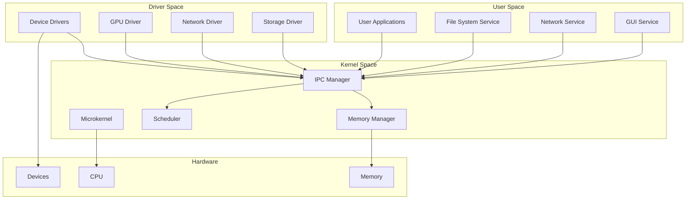
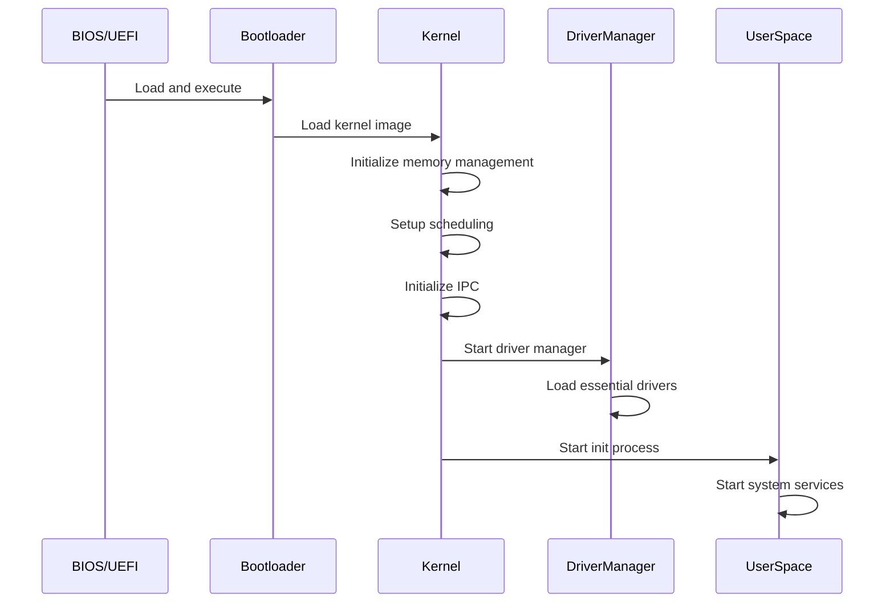
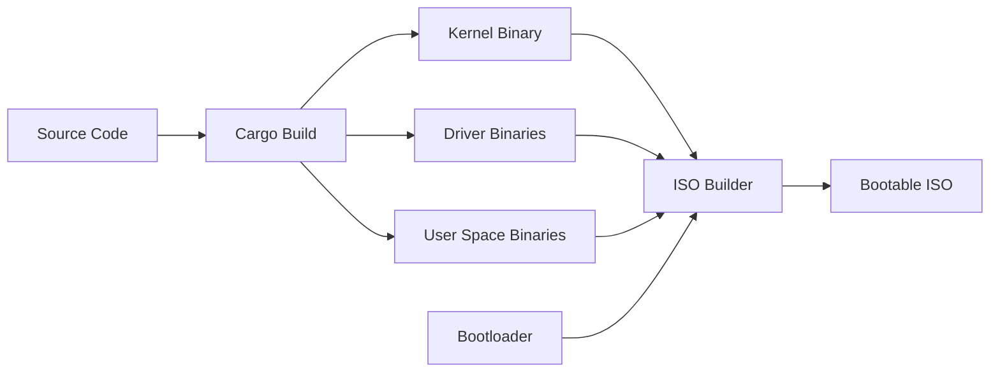

# Kosh Operating System Design Document

## Overview

Kosh is a lightweight, mobile-optimized operating system built with Rust, featuring a microkernel architecture. The design prioritizes security, performance, and resource efficiency while maintaining modularity through clear separation between kernel, user, and driver spaces. The initial implementation targets x86-64 platforms with provisions for ARM64 support.

The microkernel approach minimizes the kernel's responsibilities to essential services (memory management, scheduling, IPC), while moving device drivers, file systems, and other services to user space. This design enhances system stability, security, and maintainability.

## Architecture

### High-Level Architecture



### Memory Layout

The system uses a three-tier memory protection model:

- **Kernel Space (Ring 0)**: Contains only the microkernel core
- **Driver Space (Ring 1)**: Isolated space for device drivers with limited hardware access
- **User Space (Ring 3)**: Applications and system services with no direct hardware access

### Boot Architecture



## Components and Interfaces

### Microkernel Core

The microkernel provides minimal essential services:

**Memory Manager**
- Virtual memory management with paging
- Physical memory allocation
- Swap space management
- Memory protection between spaces

**Scheduler**
- Preemptive multitasking
- Priority-based scheduling with mobile optimizations
- Power-aware scheduling for battery efficiency
- Real-time scheduling support for interactive tasks

**IPC Manager**
- Message passing between processes
- Synchronous and asynchronous communication
- Capability-based security model
- Shared memory regions for high-performance IPC

### Driver Framework

**Driver Interface**
```rust
trait KoshDriver {
    fn init(&mut self) -> Result<(), DriverError>;
    fn handle_request(&mut self, request: DriverRequest) -> DriverResponse;
    fn cleanup(&mut self);
    fn get_capabilities(&self) -> DriverCapabilities;
}
```

**Driver Manager**
- Dynamic driver loading and unloading
- Driver dependency resolution
- Hardware detection and driver matching
- Driver isolation and fault recovery

### System Services

**File System Service**
- VFS (Virtual File System) layer
- Support for ext4 as primary file system
- Mount point management
- File permissions and metadata

**Memory Service**
- Heap allocation for user processes
- Memory mapping services
- Swap file/partition management
- Memory statistics and monitoring

### Platform Abstraction Layer (PAL)

**Hardware Abstraction**
```rust
trait PlatformInterface {
    fn get_cpu_info(&self) -> CpuInfo;
    fn setup_interrupts(&mut self);
    fn enable_mmu(&mut self, page_table: &PageTable);
    fn get_memory_map(&self) -> MemoryMap;
}
```

**Architecture Support**
- x86-64 implementation with UEFI boot support
- ARM64 interface definitions for future implementation
- Cross-compilation support through Rust's target system

## Data Models

### Process Management

```rust
struct Process {
    pid: ProcessId,
    state: ProcessState,
    memory_space: VirtualAddressSpace,
    capabilities: CapabilitySet,
    priority: Priority,
    cpu_time: Duration,
}

enum ProcessState {
    Running,
    Ready,
    Blocked(BlockReason),
    Zombie,
}
```

### Memory Management

```rust
struct VirtualAddressSpace {
    page_table: PageTable,
    heap_regions: Vec<HeapRegion>,
    stack_regions: Vec<StackRegion>,
    mapped_files: Vec<MappedFile>,
}

struct SwapManager {
    swap_devices: Vec<SwapDevice>,
    swap_cache: LruCache<PageFrame>,
    swap_algorithm: SwapAlgorithm,
}
```

### IPC System

```rust
struct Message {
    sender: ProcessId,
    receiver: ProcessId,
    message_type: MessageType,
    data: MessageData,
    capabilities: Vec<Capability>,
}

enum MessageType {
    SystemCall,
    DriverRequest,
    ServiceRequest,
    Signal,
}
```

## Error Handling

### Kernel Error Handling

- Panic-free kernel design using Result types
- Graceful degradation for non-critical failures
- Kernel debugging interface for development
- Crash dump generation for post-mortem analysis

### Driver Error Isolation

- Driver failures contained within driver space
- Automatic driver restart on recoverable failures
- Fallback mechanisms for critical drivers
- Error reporting to system monitoring service

### User Space Error Handling

- Process isolation prevents cascading failures
- Signal-based error notification
- Core dump generation for debugging
- Resource cleanup on process termination

## Testing Strategy

### Unit Testing

- Comprehensive unit tests for all kernel modules
- Mock hardware interfaces for testing
- Property-based testing for critical algorithms
- Code coverage targets of 90%+ for kernel code

### Integration Testing

- Full system boot tests in QEMU/VirtualBox
- Driver integration testing with virtual hardware
- IPC communication testing between components
- File system integrity testing

### Performance Testing

- Boot time benchmarking
- Memory usage profiling
- IPC latency measurements
- Power consumption analysis (when ARM support is added)

### Security Testing

- Capability system validation
- Memory protection testing
- Privilege escalation prevention
- Fuzzing of system call interfaces

## Build System and ISO Generation

### Build Pipeline



### ISO Structure

```
kosh.iso
├── boot/
│   ├── grub/
│   │   └── grub.cfg
│   └── kosh-kernel
├── drivers/
│   ├── storage.ko
│   ├── network.ko
│   └── graphics.ko
├── system/
│   ├── init
│   ├── fs-service
│   └── driver-manager
└── config/
    └── system.conf
```

### Cross-Platform Build Support

- Rust target specifications for x86-64 and ARM64
- Conditional compilation for platform-specific code
- Unified build scripts supporting multiple architectures
- Docker-based build environment for consistency

## Mobile Optimizations

### Power Management

- CPU frequency scaling based on workload
- Idle state management for power saving
- Background task throttling
- Display brightness control integration

### Responsive Scheduling

- Interactive task prioritization
- Touch input latency minimization
- Adaptive time slice allocation
- Real-time scheduling for UI threads

### Resource Management

- Memory compaction for fragmentation reduction
- Aggressive background app suspension
- I/O prioritization for user-facing operations
- Battery level aware resource allocation

## Security Model

### Capability-Based Security

- Fine-grained permissions for system resources
- Capability delegation between processes
- Revocable access rights
- Principle of least privilege enforcement

### Memory Protection

- Address space layout randomization (ASLR)
- Stack canaries and guard pages
- Non-executable memory regions
- Kernel address space isolation

### Driver Security

- Driver signing and verification
- Sandboxed driver execution
- Limited hardware access permissions
- Runtime driver behavior monitoring